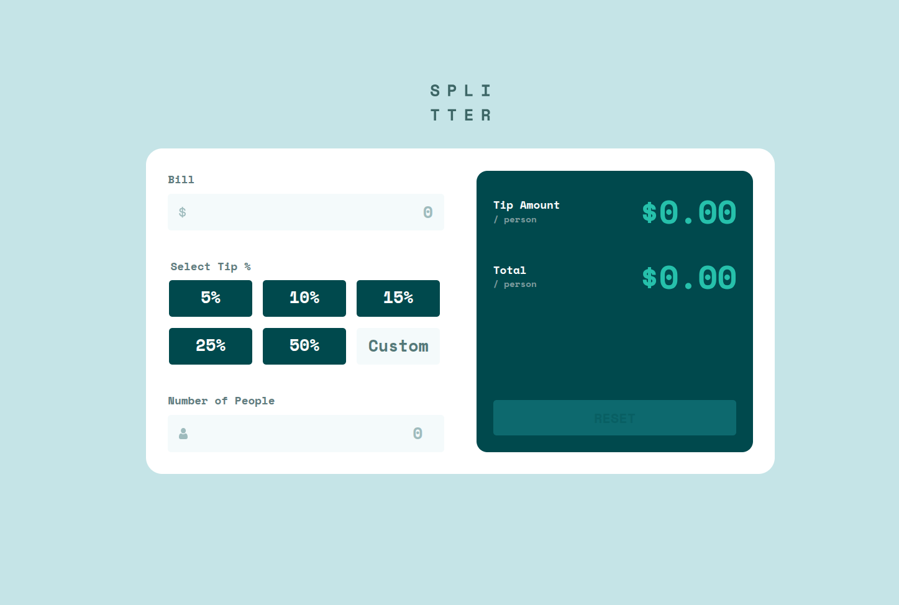

# Frontend Mentor - Tip calculator app solution

This is a solution to the [Tip calculator app challenge on Frontend Mentor](https://www.frontendmentor.io/challenges/tip-calculator-app-ugJNGbJUX). Frontend Mentor challenges help you improve your coding skills by building realistic projects.

## Table of contents

- [Overview](#overview)
  - [The challenge](#the-challenge)
  - [Screenshot](#screenshot)
  - [Links](#links)
- [My process](#my-process)
  - [Built with](#built-with)
  - [What I learned](#what-i-learned)
  - [Continued development](#continued-development)
  - [Useful resources](#useful-resources)
- [Author](#author)

## Overview

### The challenge

Users should be able to:

- View the optimal layout for the app depending on their device's screen size
- See hover states for all interactive elements on the page
- Calculate the correct tip and total cost of the bill per person

### Screenshot

### Links

- Solution URL: [Frontend Mentor Solution Submission](https://www.frontendmentor.io/solutions/tip-calculator-app-modern-css-grid-vanilla-js-GM6jd4XOB7)
- Live Site URL: [Github Pages](https://sprees.github.io/fe-mentor_tip-calculator-app/)

## My process

### Built with

- Semantic HTML5 markup
- CSS custom properties
- Flexbox
- CSS Grid
- Mobile-first workflow

### What I learned

I learned about using labels for radio buttons as buttons.

### Continued development

I am focused on writing minimal, clean modern CSS and semantic HTML with accessibility in mind. In future projects I plan to explore CSS Grid more in-depth.

### Useful resources

- [The A11y Project: How to hide content](https://www.a11yproject.com/posts/how-to-hide-content/) - This provided me with a usable utility class to hide content with accessibility in mind.
- [Youtube: @KevinPowell](https://www.youtube.com/@KevinPowell) - Kevin Powell has made learning CSS exciting and less daunting as I consume his content. I highly recommend checking him out!

## Author

- Website - [Github | Sprees](https://github.com/Sprees)
- Frontend Mentor - [@Sprees](https://www.frontendmentor.io/profile/Sprees)
